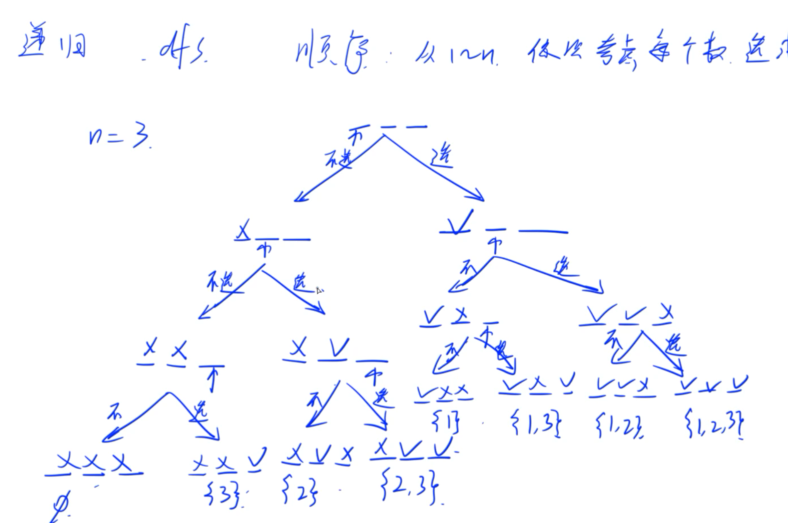
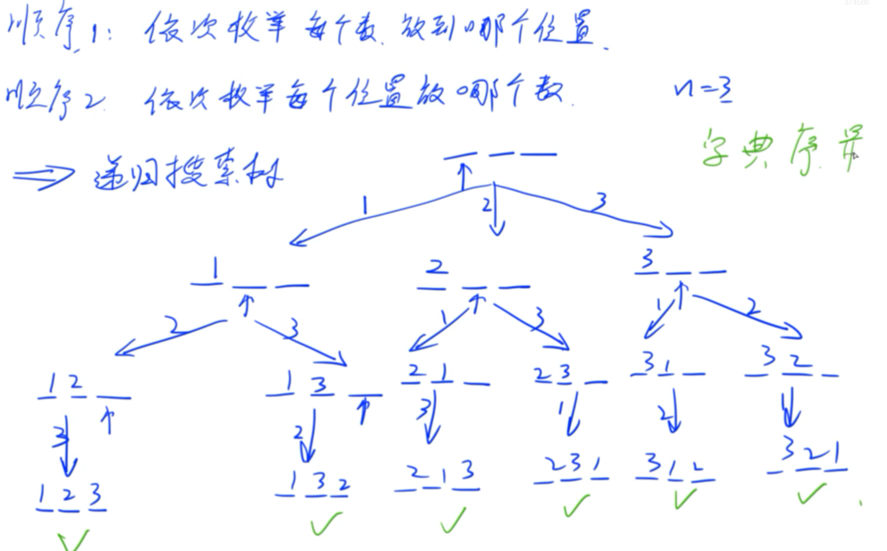
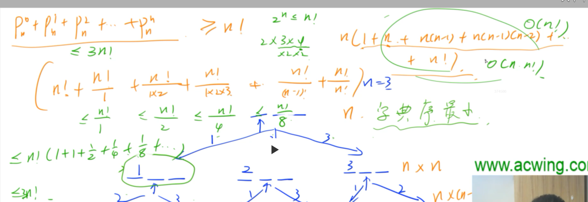

# dfs(递归)

常见的数一定要有一些概念：
2~2^10：2 4 6 8 16 32 64 128 256 512 1024；
2^20：约 10^6(一百万)；
2^16：65536；
2^15：32768；
2^63；约10^18；
9!:326880；
******

例题：
AcWing 92.递归实现指数型枚举
https://www.acwing.com/problem/content/94/

基本思路：
1) 从前往后依次考虑每个数选或者不选；

2) 思考如何用代码实现；
记录状态：开一个长度为n的数组

代码：
```
    #include<iostream>

    using namespace std;

    const int N=16;

    int n;
    int st[N];  //记录每个位置当前的状态，0表示还没考虑，1表示选他，2表示不选他；
    
    void dfs(int u)
    {
        if(u>n)
        {
            for(int i=0;i<=n;i++)
                if(st[i]==1)
                  printf("%d ",i);
                printf("\n");
                return;
        }

        st[u]=2;//第一个分支，不选
        dfs(u+1);
        st[u]=0;//恢复现场

        st[u]=1；
        dfs(u+1);//第二个分支，选
        st[u]=0;

    }
    int main()
    {
        cin>>n;
        dfs(1);
        return 0;
    }
````
另：可用二维vertor或者二维数组存下来每组数据再输出；

day.24.4.14
************
例题：
AcWing 94.递归实现排列型枚举
https://www.acwing.com/problem/content/96/

思路：
1) 依次枚举每个数放到每个位置；
2) 依次枚举每个位置放哪个数；

3) 思考如何代码实现：
开一个长度为N的数组，记录每个位置的状态；(used[])
开一个长度为N的数组，记录每个位置的数；(state[])

代码：

~~~~C++
#include<iostream>

using namespace std;

int n;
const int N=10;
int state[N];//0表示还没放数，1~n表示放了哪个数
bool used[N];//true表示用过，false表示没用过

void dfs(int u)
{
    if(u>n)
    {
        for(int i=1;i<=n;i++)printf("%d ",state[i]);
        puts("");
        
        return ;
    }
    
    for(int i=1;i<=n;i++)
        if(!used[i])
        {
            state[u]=i;
            used[i]=true;
            dfs(u+1); 
            
            //恢复现场
            state[u]=0;
            used[i]=false;
        }
}

int main()
{
    scanf("%d",&n);
    
    dfs(1);
    
    return 0;
}
~~~~~

证明dfs时间复杂度是O(n*n!):


day.24.4.15
***************


1byte(字节B)=8bit(位b)
比如，101010就是8bit，1byte
int = 4 byte;
char = 1 byte;
long long = 8 byte;
float = 4 byte;
double = 8 byte;

64MB指的64Mbyte(字节)
64*2^20 约等于 64*10^7字节
可以开 1.6*10^7 个 int;


# 关于递推
区别：
递归是将一个某一个问题分解成若干个同类子问题；
递推是先求子问题，再由子问题去推原问题；


AcWing 95.费解的开关
https://www.acwing.com/problem/content/97/

将第一行的操作看成一个二进制数，其范围为0~2^5-1;
看i的第k+1位：i>>k&1;